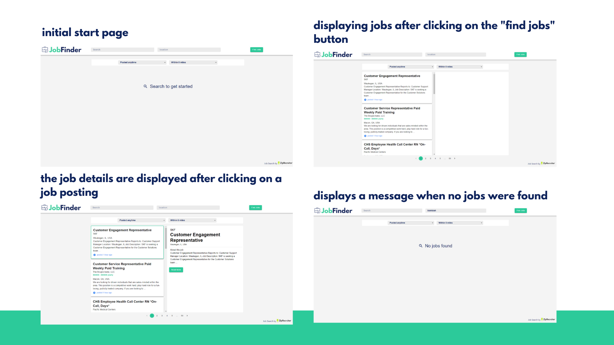

This project was bootstrapped with [Create React App](https://github.com/facebook/create-react-app).

## About

JobFinder is a small React App that lets you search for jobs using the ZipRecruiter API.

## Getting Started

Before running the project, open FetchJobs.ts and replace the API key with a valid ZipRecruiter API key.

```
 const apiKey = "ENTER YOUR API KEY HERE";
```

## Running The Project

In the project directory, run:

### `yarn install`

### `yarn start`

<br />

Open [http://localhost:3000](http://localhost:3000) to view it in the browser.

## Running Tests

In the project directory, run:

### `yarn test`

<br />

